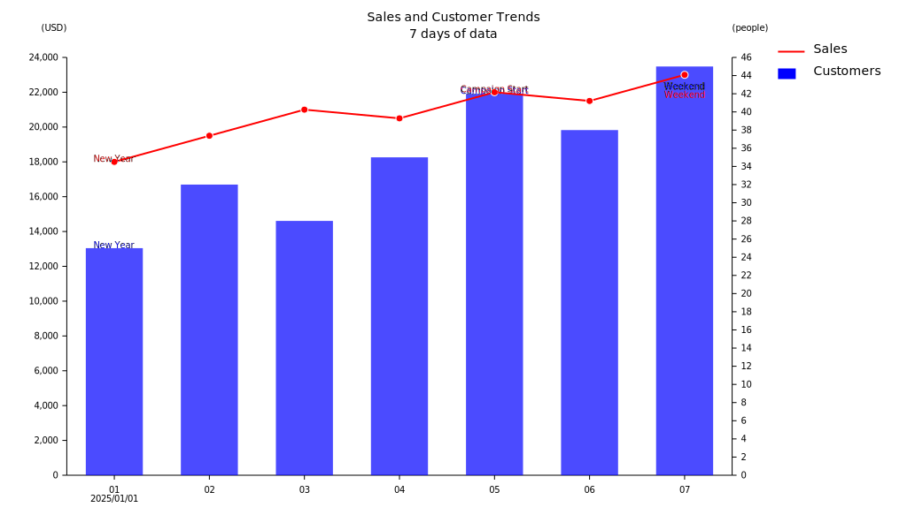
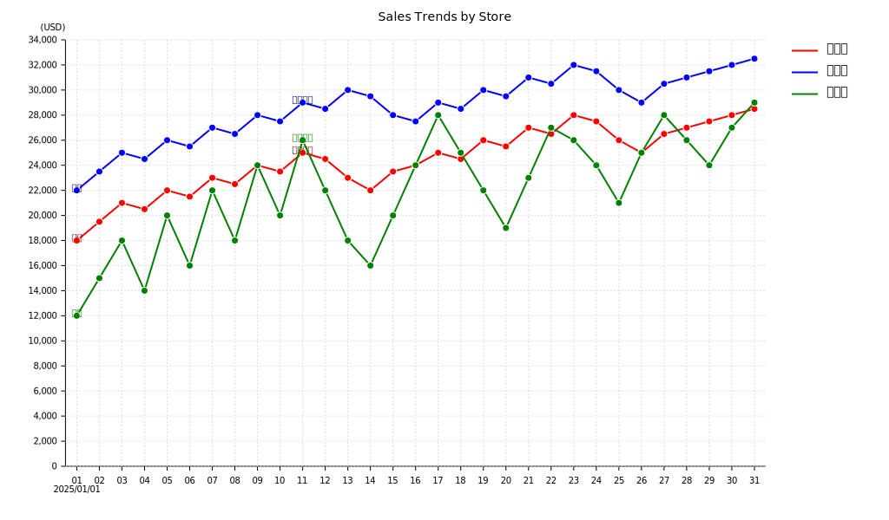
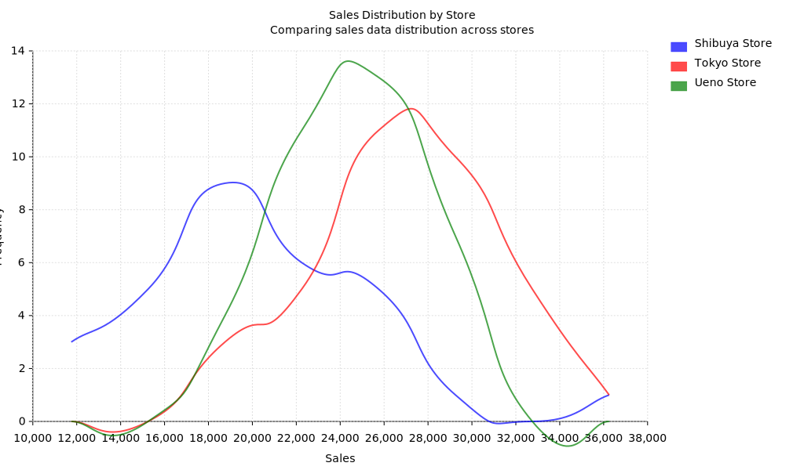

# ChartCanvas

A JavaScript library for creating and visualizing charts with SVG output.

## Overview

ChartCanvas is a lightweight, dependency-free JavaScript library for creating various types of charts including line charts, bar charts, and pie charts. It focuses on time-series data visualization with date-based X-axis support.

**Key Features:**
- **Zero Dependencies**: No external libraries required - works with pure JavaScript
- **DOM-Free Mode**: Can run without DOM (headless mode) for server-side and CLI usage
- **Node.js Compatible**: Works in both browser and Node.js environments

## Features

- **Line Charts**: Create line graphs with customizable styles
- **Bar Charts**: Display data as bars with support for grouped and stacked bars
- **Pie Charts**: Create pie charts with automatic label positioning
- **Date-based Charts**: Specialized support for time-series data with date X-axis
- **Dual Axis Support**: Display multiple series with different scales
- **TSV/CSV Data Loading**: Load data from TSV/CSV files
- **SVG Output**: Export charts as SVG images
- **Automatic Scaling**: Intelligent Y-axis scaling based on data range
- **Label Management**: Automatic label positioning and formatting

## Quick Start

### Basic Usage

```html
<!DOCTYPE html>
<html>
<head>
    <script src="chartcanvas.js"></script>
</head>
<body>
    <div id="chart_div"></div>
    <script>
        const chart = new ChartCanvas(document.getElementById('chart_div'));
        chart.size(1024, 600);
        
        const dateChart = chart.addDateChart();
        dateChart.xAxisTitle = 'Date';
        dateChart.yAxisTitle = 'Sales';
        dateChart.title = 'Sales Trend';
        
        const line = dateChart.addLine({
            title: 'Sales',
            color: 'red'
        });
        
        line.addData('20250101', 20000);
        line.addData('20250102', 21000);
        // ... add more data
        
        chart.render();
    </script>
</body>
</html>
```

### Loading Data from TSV

```javascript
const loader = dateChart.tsvLoader('data.tsv');
loader.dateTitle = 'Date';
loader.valueTitle = 'Sales';
loader.groupTitle = 'Store';

await loader.load();
chart.render();
```

### CLI Usage

ChartCanvas can also be used from the command line without any dependencies (no Puppeteer or browser required):

```bash
# Using a config file
cat data.tsv | node cli.js -c config.json > output.svg

# Using inline JSON config
cat data.tsv | node cli.js -j '{"chartType":"dateChart","tsv":{"dateTitle":"日付","series":[{"type":"line","title":"売上","column":"売上"}]}}' > output.svg
```

**Note:** The CLI uses Node.js's built-in `vm` module and works completely headless - no DOM or browser dependencies required.

See [CLI Specification](./docs/21-CLI仕様.md) and [CLI Config JSON Specification](./docs/22-CLI設定JSON仕様.md) for details.

## Sample Outputs

### Date Chart (Line/Bar Chart)

Example of a date chart with line and bar series:



### Group Date Chart

Example of a group-based date chart showing multiple stores:



### Histogram

Example of a histogram showing data distribution:



All sample outputs are available in:
- `docs/sample/images/` - Sample chart images
- `docs/sample/output/` - Sample HTML outputs (gitignored)
- `test-cli-output/` - CLI test outputs (gitignored)

## Project Structure

```
char002/
├── src/              # Source code (multiple JavaScript files)
├── docs/             # Documentation (in Japanese)
│   ├── sample/       # Sample HTML files
│   └── *.md          # Specification documents
├── webservice/       # Development web server
└── README.md         # This file
```

## Development

### Running the Development Server

The project includes a simple web server for development:

```bash
cd webservice
npm start
```

Then access:
- http://localhost:3000/ - Index page with file links
- http://localhost:3000/chartcanvas.js - Dynamically bundled JavaScript
- http://localhost:3000/001.html - Sample 1
- http://localhost:3000/002.html - Sample 2

### Building

The `chartcanvas.js` file is automatically bundled from `src/` directory when accessed via the web server. The server dynamically combines all JavaScript files in the `src/` directory.

## Documentation

Detailed documentation (in Japanese) is available in the `docs/` directory:

- [Project Overview](./docs/01-プロジェクト概要.md)
- [Functional Requirements](./docs/02-機能要件.md)
- [Technical Requirements](./docs/03-技術要件.md)
- [API Specification](./docs/08-API仕様.md)
- [Rendering Flow](./docs/19-レンダリング処理フロー.md)
- [TSV Loader API](./docs/20-002.html仕様（TSVローダーAPI）.md)
- [CLI Specification](./docs/21-CLI仕様.md)
- [CLI Config JSON Specification](./docs/22-CLI設定JSON仕様.md)

## License

ISC

## Status

This project is currently in development. The API and features are subject to change.

